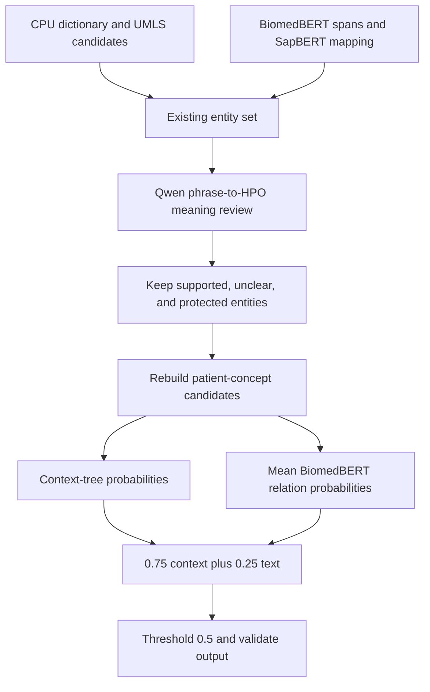

# B-stage optimization and joint-pipeline experiment record

Recorded on 2026-09-30 (Asia/Shanghai). Scope: B-stage work after the previously committed baseline `52f9430c2cd4867f58e96cc693be8af60a64801c`, including training, inference, confirmation, and unsuccessful experiments completed on September 28–29. [中文版](zh.md). No new training was launched for this documentation task.

## 1. Findings and score attribution

The joint pipeline achieved **0.6907698051** in fivefold out-of-fold development evaluation on 80 training documents, compared with **0.6819157000** for the context-linking baseline: an absolute improvement of **0.0088541051**. The fixed composition passed its two-fold screen and remaining-fold confirmation before producing a B-set candidate. Here, joint means a sequential prediction pipeline, **not a newly trained end-to-end joint model**.

The only confirmed official feedback is **0.6152** for the pure CPU file `patientphex_b_cpu.jsonl`. The user identified this file as the submission timestamped 2026-09-29 00:55:05; its four F1 scores are 0.6609, 0.7296, 0.5753, and 0.4950. Attribution comes from the user-supplied leaderboard row and filename confirmation, not a direct platform query. There is no official joint score yet. This workflow did not submit a file to the competition platform, and the development result does not establish that the official 0.70 target has been reached.

Evidence: [official feedback](../official_feedback/b_cpu.json), [joint fivefold summary](../joint_confirmation/summary.json), [B inference summary](../joint_b/summary.json), and [independent B replay verification](../joint_b_verification/summary.json).

## 2. Data, resources, and evaluation protocol

| Resource | Role and constraints |
|---|---|
| `PatientPheX-V1-A/PatientPheX-train.jsonl` | The only supervised training set: 80 documents and 209 patients. The directory name does not imply using A-test answers. |
| `PatientPheX-V1-B/PatientPheX-V1-B.jsonl` | Current blind target: 100 documents and 244 patients; used for prediction, schema, and coverage checks only. |
| HPO `2026-06-23` | Fixed ontology; 19,119 allowed descendants of `HP:0000118`, excluding the root. |
| UMLS/HPO terminology | Stored under `/home/dcf/umls/`; modeling uses a frozen HPO terminology export and the required ontology release. Raw licensed data is excluded from this Git submission. |
| Document splits | Existing [fivefold split](../cpu_baseline/split.json), stratified by single-/multiple-patient documents: 64 training and 16 validation documents per fold. |

Training-derived dictionaries, disambiguation statistics, and supervised models use only the corresponding outer training fold. Relation training candidates come from inner CPU cross-fitting within that training fold, rather than in-sample predictions or gold entities. Inference removes answer fields while preserving source text, patient information, and character offsets. The fixed ontology and external pretrained models may be shared across folds.

The local total score is the equal-weight mean of mention F1, document-concept F1, association Micro F1, and association Macro F1. A score computed from pooled out-of-fold predictions is distinct from the mean of fold scores; both are labeled explicitly below. No official scorer is available. Main-text eligibility, `-1`, and compound-ID handling remain implementation assumptions documented in the [summary's approximations](../joint_confirmation/summary.json). For example, compound identifiers are split, only `NO` denotes negation, and unusual gold identifiers are not automatically repaired.

All five folds had already been inspected during prior development. “Remaining-fold confirmation” is a check with this composition frozen, not evaluation on a previously untouched test set. The B set has no local ground truth and therefore no locally measurable accuracy.

## 3. Main changes included in this snapshot

| Layer | Change and purpose | Main entry points |
|---|---|---|
| CPU B control | Explicit A/B routing, a fresh four-configuration CV run and B prediction, 100-document/244-patient checks, existing-output protection | [CLI](../../patientphex/__main__.py), [CPU report](../cpu_b_control/report.md) |
| Terminology and neural entities | Unambiguous UMLS aliases, BiomedBERT spans, SapBERT normalization, original offsets retained | [UMLS](../../patientphex/umls_augmentation.py), [semantic linking](../../patientphex/semantic_linking.py) |
| Structural association | Inner cross-fitting, context trees, negative weighting, and document-abbreviation comparisons | [context_linking.py](../../patientphex/context_linking.py), [context report](../association_context/report.md) |
| Qwen experiments | Separate runtime; extraction, evidence references, constrained decoding, patient markers, and concept review; unsuccessful runs retained | [environment ledger](../span_ner/environment_ledger.md), [concept review](../../patientphex/llm_concept_review.py) |
| Supervised relations and joint | Marked relation inputs, three-seed ensemble, recomputation after filtering, complete B queue and replay verification | [relation_text.py](../../patientphex/relation_text.py), [joint_review.py](../../patientphex/joint_review.py), [B controller](../../scripts/run_joint_b.py) |
| Residual errors | Candidate reachability, mapping, boundary, and patient-attribution audits; restricted overlap screening with stop criteria | [error report](../entity_residuals/joint_report.md), [screening script](../../scripts/screen_nested_candidates.py) |

Code, frozen plans, logs, out-of-fold predictions, and candidate submissions together provide experiment provenance. Failed approaches are retained as failures. Model weights, environments, execution caches, and raw licensed UMLS remain on the server rather than being committed as ordinary Git files.

## 4. How the joint result was produced



### 4.1 Upstream entities and context baseline

The pure CPU control selected `dictionary+nearest` from four combinations of dictionary/learned entity filtering and nearest-patient/learned association. UMLS augmentation adds unambiguous aliases without overwriting existing spans, with a learned-filter threshold of 0.6. The subsequent neural stage uses the fixed epoch-5 BiomedBERT span model and SapBERT normalization: `ner0.9_semantic0.9`, semantic margin 0.02, and an overlap veto. The terminology index contains 79,899 expressions covering 19,119 HPO concepts.

Context linking selected `leaves7_t0.5`: a `HistGradientBoostingClassifier` with learning rate 0.05, 150 iterations, seven leaves, minimum leaf size 20, L2=5, no early stopping, and seed 20260929. Features represent patient-mention distances, sentence/paragraph/section ownership, shared entity occurrences, and lengths; document and patient IDs are not memorization features. Training uses patient-balanced weights and negative-class weight 0.5. This stage scores 0.6819157000 and is the direct joint baseline.

### 4.2 Qwen reviews concept meaning only

Qwen3-8B judges whether the source phrase supports the assigned HPO meaning. It does not decide which patient owns the phenotype, and background discussion, another patient, or a negated sentence alone are not grounds for a concept mismatch.

Eligible items are existing positive entities with a single allowed HPO ID. Protected items include `NO`, unmapped entities, semicolon-separated compound IDs, and unique exact matches to official HPO names or synonyms. Inputs contain up to 400 characters on each side within the original paragraph, up to two same-document abbreviation definitions with nearby text, the HPO name, its first four exact synonyms, and a truncated definition. Source offsets are unchanged; no answer labels or annotated examples are supplied.

Inference uses non-thinking mode, greedy decoding, at most 64 new tokens, one beam, and a finite JSON grammar. Decisions are `supported`, `other_or_general`, or `unclear`; only `other_or_general` is removed. No entities are added, boundaries rewritten, or HPO assignments replaced. A 100% format success rate establishes protocol compliance, not semantic accuracy. This stage uses the pretrained Qwen model without task fine-tuning or LoRA training; an earlier small LoRA witness was only an environment check.

### 4.3 Supervised patient–phenotype relation model

BiomedBERT predicts whether a given patient and candidate HPO concept should be linked. Its input contains an HPO header, the patient reference, and the three positive concept occurrences nearest the target anchor. Six explicit markers are used: `[TARGET]`, `[/TARGET]`, `[OTHER]`, `[/OTHER]`, `[PHENOTYPE]`, and `[/PHENOTYPE]`. Token budgets are 32 for the header, 64 for the patient reference, and 92 per occurrence, with a maximum length of 384. Centered cropping preserves the marked focus.

The actual BiomedBERT vocabulary lacked the initially assumed reserved tokens. Before real training, this was fixed by adding six tokens, expanding the vocabulary from 30,522 to 30,528 with seeded initialization and `mean_resizing=False`. The failed preflight remains recorded and is not counted as successful training.

The classifier is the encoder's CLS representation followed by dropout 0.1 and a binary linear head. Full-encoder fine-tuning runs for a fixed three epochs and uses the final checkpoint. Settings: AdamW, learning rate 2e-5, batch size 12, weight decay 0.01, 10% warmup, gradient clipping at 1, FP16, and initial AMP scale 1024. The loss uses patient balancing and negative-class weight 0.5. Candidates are inner CPU out-of-fold predictions; labels come only from the corresponding training documents' associations. Candidate pairs without annotated links are treated as negatives, which also encodes the dataset's annotation conventions.

Seeds are fixed at **20260929, 20260930, and 20261001**; the best seed is not selected. The initial seed supplies five fold models, and the other two add ten training runs, totaling 15 models. The joint stage reuses these models without further joint gradient training.

### 4.4 Why associations must be recomputed after entity filtering

Removing an entity can change candidate patient–concept pairs, distance features, and the text of the nearest three occurrences. Adding gains from separate experiments or blindly reusing old probabilities would not evaluate the actual sequential pipeline.

The implementation first verifies exact replay of the context baseline, then applies concept filtering and rebuilds candidates and structural features. A neural probability is reused only if **the checkpoint and all three encoded arrays—`input_ids`, `attention_mask`, and `token_type_ids`—match exactly**. Changed inputs are re-inferred; vanished candidates are removed. In the two-fold screen, 18 of 1499 and 29 of 1234 inputs changed per seed, respectively.

The fixed decision rule is:

```text
p_text = mean(p_text_model)
p_joint = 0.75 * p_context + 0.25 * p_text
emit association if p_joint >= 0.5
```

For development evaluation, each document uses only the three seed models corresponding to its held-out outer fold; models from other folds may have trained on that document and are excluded. B documents are outside the training corpus, so B inference averages **all 5 folds × 3 seeds = 15 models**, combined with a context tree fitted using all 80 training documents. No fold or seed is selected, and B does not determine the threshold.

## 5. From unsuccessful components to a fixed composition

The following tables have different evaluation scopes and must not be compared interchangeably. Component gains are not additive. After standalone components failed their gates, a new hypothesis—concept denoising and patient attribution may complement each other—was frozen as one joint policy and subjected to the complete screen and confirmation. Earlier failures were not reclassified as passes.

### Two-fold screen: folds 0/1, 32 documents, 88 patients

The common context baseline has a pooled score of **0.674959**.

| Experiment | Pooled two-fold score | Outcome and reason |
|---|---:|---|
| Best Qwen direct-extraction augmentation | 0.674790 | Not promoted; below baseline |
| Qwen acronym-support filtering | 0.680912 | Mean fold gain 0.006051, below 0.008 |
| Free quotations / numbered excerpts for ownership review | Not scored | Evidence-match or reference-count constraints failed before accuracy evaluation |
| Grammar-constrained ownership review | 0.673582 | 100% format success; removed 41 false links and 19 true links |
| Ownership review with patient markers | 0.674561 | Removed 42 false links and 23 true links |
| Qwen concept-meaning review | 0.679213 | 747 tasks; mean fold gain 0.004528, below 0.008 |
| Single-seed relation model, 25% text blend | 0.685286 | Mean fold gain 0.010512; passed screening |
| Same model, 50% blend / text only | 0.674487 / 0.652299 | Neither promoted |
| Fixed sequential joint pipeline | **0.691631** | Mean fold gain **0.017393**; passed screening |

Sources: [extraction](../llm_extraction/report.md), [support filtering](../llm_corroboration/report.md), [constrained ownership](../llm_association_constrained/report.md), [patient markers](../llm_patient_markers/report.md), [concept review](../llm_concept_review/report.md), [supervised relations](../relation_text/report.md), and [joint screen](../joint_review/report.md).

### Fivefold development: 80 documents, 209 patients

| Method | Pooled out-of-fold score | Decision |
|---|---:|---|
| Fresh pure CPU B control | 0.639727 | Official B score 0.6152 is recorded separately |
| CPU + UMLS | 0.645014 | Adopted |
| Neural spans + SapBERT normalization | 0.668747 | Adopted |
| Context-linking baseline | 0.681916 | Direct joint comparator |
| Document abbreviations | 0.683887 | Gain 0.001971, below 0.003 |
| BIO corroborating evidence | 0.686504 | Passed screening; remaining-fold mean gain 0.000710 failed confirmation |
| Single-seed text-relation blend | 0.687068 | Remaining-fold mean gain 0.001960; bootstrap lower bound -0.000191 |
| Three-seed text-relation blend | 0.687283 | Remaining-fold mean gain 0.000986, below 0.003 |
| Deletion-only relation ablation | 0.684913 | Failed the complete gate set |
| **Sequential joint pipeline** | **0.690770** | **Passed all frozen confirmation gates** |

Sources: [UMLS](../umls_augmentation/report.md), [semantic linking](../semantic_linking/report.md), [context linking](../association_context/report.md), [abbreviations](../document_abbreviations/report.md), [BIO confirmation](../bio_corroboration/report.md), [single-seed confirmation](../relation_confirmation/report.md), [three-seed ensemble](../relation_seed_ensemble/report.md), and [deletion ablation](../relation_veto/report.md).

## 6. Fivefold joint confirmation and tradeoffs

| Metric | Context baseline | Joint | Difference |
|---|---:|---:|---:|
| Mention F1 | 0.709984 | 0.717433 | +0.007450 |
| Document-concept F1 | 0.774440 | 0.777778 | +0.003338 |
| Association Micro F1 | 0.656906 | 0.662179 | +0.005273 |
| Association Macro F1 | 0.586333 | 0.605689 | +0.019356 |
| Equal-weight total | 0.681916 | **0.690770** | **+0.008854** |

| Fold | Baseline score | Joint score | Difference |
|---|---:|---:|---:|
| 0 | 0.689770 | 0.696893 | +0.007123 |
| 1 | 0.655121 | 0.682784 | +0.027663 |
| 2 | 0.682623 | 0.680103 | **-0.002519** |
| 3 | 0.689842 | 0.694692 | +0.004850 |
| 4 | 0.694909 | 0.704170 | +0.009261 |

The two-fold screen required mean fold gain ≥0.008, worst-fold loss ≤0.002, component F1 loss ≤0.002, improved mention F1, and format success ≥0.98. Full confirmation required remaining-fold mean gain ≥0.003, pooled score gain ≥0.005, at least four non-worse folds, component loss ≤0.002, improved mention F1, valid format, and a positive document-bootstrap lower bound. See the [screening plan](../../experiments/joint_review/plan.json) and [confirmation plan](../../experiments/joint_review/confirmation_plan.json).

The observed remaining-fold mean gain is **0.0038639590**. Four folds improve and one declines. Fold 2's -0.002519 is retained explicitly: full confirmation uses the predeclared four-non-worse-fold rule, not a requirement that all five folds satisfy the screening loss limit of 0.002. A paired document bootstrap with 2000 iterations and seed 20260929 yields a 95% gain interval of **[0.003629, 0.014491]**, with positive gain in 0.9985 of resamples. This is descriptive uncertainty after model selection, not a selection-adjusted significance test.

Entity evaluation loses **199 false positives and 44 true positives**: TP/FP/FN changes from 4114/1541/1820 to 4070/1342/1864. Associations lose a net **69 false positives and 18 true positives**: 1346/581/825 becomes 1328/512/843. Gains mainly reflect higher precision and better patient macro performance, without improved recall. Evaluation units may split compound concepts and must not be equated with JSON entity-record counts.

## 7. B artifact and engineering verification

After confirmation, the [frozen B plan](../../experiments/joint_b/plan.json) was executed. The 100 documents were divided into two whole-document shards of 50. They produced 1344 and 1345 concept-review tasks, totaling **2689**, with no format failures. The shards removed 162 and 191 entity records, totaling **353**. These are model-judged meaning mismatches, not verified B-set errors.

After filtering, all 15 text models evaluated **7122 patient–concept candidates**, and the full-training context model recomputed its probabilities. Individual model probabilities were saved and fused by the fixed rule. The association stage recorded 437.37 seconds and 1.45 GiB peak allocated GPU memory; these figures exclude preceding Qwen review and training costs.

| Item | Context B file | Joint B file |
|---|---:|---:|
| Documents / patients | 100 / 244 | 100 / 244 |
| Entity records | 7310 | 6957 |
| Patient–concept associations | 2301 | 2207 |
| `NO` / unmapped / compound records | 369 / 46 / 5 | 369 / 46 / 5 |

Relative to context predictions, 80 associations were added and 174 removed, affecting 117 patients. These change counts do not measure accuracy gains. All 4621 protected entities remain intact, and every retained entity is exactly an original record. Source order, patient coverage, and source spans pass validation without warnings. The earlier context file was not overwritten.

Final artifact: [patientphex_b_joint.jsonl](../../submissions/patientphex_b_joint.jsonl), 810,737 bytes, SHA-256:

```text
7ad32cfddfc783cbb40a105fbee2bb433ddf2b6120b56a8a7861a107475d5a0c
```

During historical server acceptance, [verify_joint_b.py](../../scripts/verify_joint_b.py) checked hashes, lengths, finite values, and coverage for all 15 saved probability arrays, independently recomputed fusion and predictions, and obtained an exact replay. It also checked deletion scope and protected entities. This establishes artifact integrity, not B accuracy.

## 8. Latest follow-up: restricted overlap candidates failed

Error analysis found 174 missed gold mentions with exact neural candidates meeting the frozen confidence thresholds but blocked by the original overlap veto. A [restricted overlap screening plan](../../experiments/nested_span_screen/plan.json) was therefore frozen. It allowed containment only, prohibited crossing spans, overlap with `NO`, and modification of existing entities, and required additions to be mutually non-overlapping. Span confidence 0.9, semantic confidence 0.9, and margin 0.02 were unchanged.

The two-fold screen added **361 entity evaluation units: 50 correct and 311 incorrect**. Mention F1 fell from **0.725775 to 0.689686**, declining on both folds. Document F1 changed from 0.795098 to 0.794860. The required mention improvement of at least 0.003 and non-worse performance on both folds were not achieved, so expansion stopped.

Associations were not recomputed in this screen; **there is no four-component total score to report**. No remaining-fold extension or GPU inference followed, and the joint B artifact was untouched. Code, three boundary-regression tests, and negative results are retained: [overlap_candidates.py](../../patientphex/overlap_candidates.py), [tests](../../tests/test_overlap_candidates.py), and [screening report](../nested_span_screen/report.md).

## 9. Limitations and evidence for future work

Of 843 association false negatives, **551 (65.4%)** lack the required concept in the current entity set: 534 were already missing and 17 disappeared after concept review. The other 292 have available concepts but failed attribution: 155 were unassigned and 137 were assigned only to another patient. Changing association thresholds alone cannot recover most missing concepts.

Among 1864 missed entity units, 1642 normalized expressions are absent from the corresponding outer training entity phrases and official HPO names/exact synonyms. This does **not** establish absence from UMLS. Likewise, absence of an exact span from the saved high-confidence neural cache does not mean the model never generated a lower-confidence candidate. Association macro F1 is 0.542716 on 13 documents with at least five patients, versus 0.679829 on 36 single-patient documents; multi-patient attribution remains difficult.

Further limits include selection bias from repeated development use, the distribution difference between inner CPU training candidates and richer validation/B entity candidates, treating unannotated pairs as negatives, and using three held-out models per development document but 15 models on B. Official gains require feedback tied to the exact artifact. Future work should freeze targeted recall or multi-patient experiments, rather than reinterpret the failed overlap screen as an improvement. See the [association audit](../entity_residuals/joint_report.md) and [recall-source audit](../entity_residuals/joint_recall_sources.json).

## 10. Environment, fingerprints, and reproduction limits

The server root is `10.253.27.177:/home/dcf/chip2026/`; only authorized GPUs 0/2 were used. Span/relation training uses the project `.venv`: Python 3.12.13, PyTorch 2.6.0+cu124, and Transformers 4.49.0. Qwen uses `experiments/llm_runtime/.venv`: Transformers 4.51.3, the same PyTorch version, PEFT 0.15.2, and Accelerate 1.6.0, with FP16 eager execution and no quantization. Server SQLite access uses `/usr/bin/python3`. See the [environment ledger](../span_ner/environment_ledger.md).

| Model | Frozen revision |
|---|---|
| `microsoft/BiomedNLP-BiomedBERT-base-uncased-abstract-fulltext` | `e1354b7a3a09615f6aba48dfad4b7a613eef7062` |
| `cambridgeltl/SapBERT-from-PubMedBERT-fulltext` | `090663c3ae57bf35ffe4d0d468a2a88d03051a4d` |
| `Qwen/Qwen3-8B` | `b968826d9c46dd6066d109eabc6255188de91218` |

| Key object | SHA-256 |
|---|---|
| Fivefold joint out-of-fold predictions | `21d0b06ac500fd18de2a057374e4431dae870bcb3b9034da1f7c485a66fc3972` |
| Joint two-fold plan | `7de32d238329004b65e4ce33ea2c7625cfe7d0fed99af06fd054c162ee9a6469` |
| Joint confirmation plan | `89bdabf695a66d42eb6231e0c08b14bb9af3bf41378257e5a8fe48eb6023cea4` |
| B generation plan | `e9449586e4f7f11eaf84d5c0ffd39351b90ef862a71c217942e586a84f6c231b` |
| Restricted overlap plan | `1c8cac0621a3a88dd738ea9c253c2abe2d9e707f3bb71e8e6c06cb3c381936c9` |

Frozen plans bind input and code hashes. Outputs are covered by the [fivefold manifest](../joint_confirmation/artifact_manifest.json), [B manifest](../joint_b/artifact_manifest.json), and [overlap-screen manifest](../nested_span_screen/artifact_manifest.json). Documentation-time checks on September 30 are recorded in [verification.json](verification.json). The local suite discovered 157 tests: 146 passed and 11 were skipped because the optional PyTorch training dependency is absent. The directly inspectable joint-screen server [log](../joint_review/regression.log) records 152 passing tests; the later [stage summary](../optimization_status.md) reports 154 after B checks were added. These describe different stages. SSH timed out during this documentation task, so a fresh 157-test server run is not claimed.

Lightweight checks from the repository root:

```powershell
uv run --no-sync python -m unittest discover -s tests -v
uv run --no-sync python -m patientphex validate --target-set B --input submissions/patientphex_b_joint.jsonl --report reports/experiment_record/local_validation.json
```

Once server connectivity is restored and the original caches are available:

```bash
cd /home/dcf/chip2026
.venv/bin/python scripts/check_joint_b.py
.venv/bin/python scripts/verify_joint_b.py
```

Full recomputation depends on inner CPU candidates, context models and semantic entities, fixed three-seed relation training, concept review and joint screening, remaining-fold confirmation, and finally B generation. Controllers include `run_relation_experiment.py`, `run_relation_seed_ensemble.py`, `run_joint_review.py`, `confirm_joint_review.py`, and `run_joint_b.py`; their plans specify arguments, wrappers, and hash checks. Existing outputs are protected against overwriting. New experiments require explicitly recorded new output directories and plans rather than replacing this record. A Git clone does not include weights, licensed terminology exports, or server caches and is therefore insufficient for full training or probability replay. Preserve file bytes at checkout, including line endings, to retain the frozen fingerprints.
