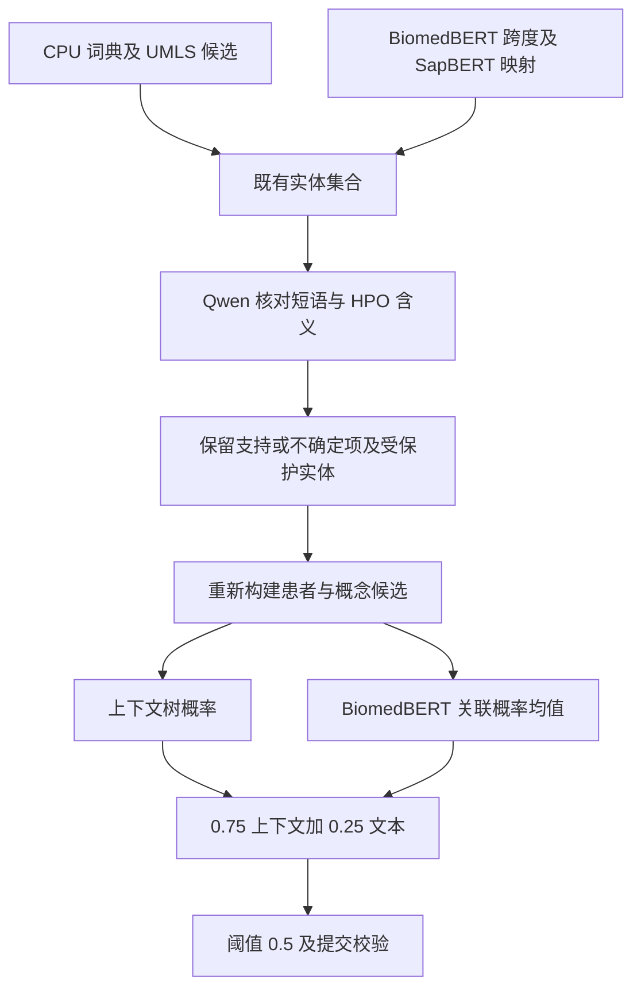

# B 榜优化与 joint 联合流水线实验记录

记录日期：2026-09-30（Asia/Shanghai）。范围：此前已提交版本 `52f9430c2cd4867f58e96cc693be8af60a64801c` 之后的 B 榜优化，包括 2026-09-28 至 29 日完成的训练、推理、确认及失败试验。对应 [English version](en.md)。本次整理没有启动新训练。

## 1. 结论与成绩归属

当前 joint 方案在 80 篇训练文献的五折折外开发评估中取得 **0.6907698051**，高于上下文关联基线 **0.6819157000**，绝对增益 **0.0088541051**。其固定组合通过两折筛选和后三折确认，随后生成了 B 集候选文件。这里的 joint 指顺序组合的预测流水线，**并非新增的端到端联合训练模型**。

截至本记录，唯一已确认的官方反馈是纯 CPU 文件 `patientphex_b_cpu.jsonl` 的 **0.6152**。用户确认该分数对应 2026-09-29 00:55:05 的提交；四项 F1 依次为 0.6609、0.7296、0.5753、0.4950。来源是用户提供的官方榜单行及文件归属确认，未直接查询赛事平台。joint 尚无官方分数，本流程没有自动向赛事平台提交文件，也不能据开发分数认定已达到官方 0.70 的目标。

证据：[官方反馈](../official_feedback/b_cpu.json)、[joint 五折汇总](../joint_confirmation/summary.json)、[B 推理汇总](../joint_b/summary.json)、[B 独立重放验证](../joint_b_verification/summary.json)。

## 2. 数据、资源与评估协议

| 对象 | 实际用途与约束 |
|---|---|
| `PatientPheX-V1-A/PatientPheX-train.jsonl` | 唯一监督训练集：80 篇文献、209 名患者；名称中的 A 不表示使用 A 榜测试答案 |
| `PatientPheX-V1-B/PatientPheX-V1-B.jsonl` | 当前盲测目标：100 篇文献、244 名患者；只用于预测、格式和覆盖检查 |
| HPO `2026-06-23` | 固定本体；允许 `HP:0000118` 的 19,119 个后代概念，不含根节点 |
| UMLS/HPO 术语 | 服务器位于 `/home/dcf/umls/`；建模使用冻结的 HPO 术语导出及指定版本体，原许可数据不纳入本次 Git 提交 |
| 文献级划分 | 沿用 [固定五折划分](../cpu_baseline/split.json)，单患者/多患者分层；每折 64 篇训练、16 篇验证 |

训练词典、消歧统计和监督模型均限制在各外层折的训练文献。关联模型的训练候选进一步来自外层训练集内的 CPU 交叉预测，避免直接把同文献拟合结果或真实体作为候选输入。推理接口移除答案字段，保留原文、患者信息和字符偏移。固定本体和外部预训练模型可跨折使用。

本地总分为实体提及 F1、文档概念 F1、关联 Micro F1、关联 Macro F1 的等权平均。汇总折外总分与各折总分的平均不是同一个量，本文分别标明。没有官方 scorer：正文范围、`-1`、复合 ID 等处理仍是项目对公开规则的实现假设；[汇总中的 approximations](../joint_confirmation/summary.json) 保留完整说明。例如复合 ID 拆分评分，只有 `NO` 表示否定，金标准异常 ID 不自动修复。

所有五折文献在前序开发中已被反复使用。所谓“后三折确认”是冻结本次组合后的开发检查，不是从未使用过的独立测试集。B 集无本地真值，不能计算其准确率。

## 3. 本次纳入版本管理的主要改动

| 层次 | 改动及目的 | 主要入口 |
|---|---|---|
| B 榜 CPU 对照 | 显式区分 A/B 目标；重新执行四配置五折选择及 B 预测；检查 100 篇/244 人，保护已有输出 | [CLI](../../patientphex/__main__.py)、[CPU 报告](../cpu_b_control/report.md) |
| 术语与神经实体 | UMLS 无歧义别名补充；BiomedBERT 跨度与 SapBERT 语义映射；保留原文跨度 | [UMLS](../../patientphex/umls_augmentation.py)、[语义映射](../../patientphex/semantic_linking.py) |
| 结构化关联 | 内层交叉候选、上下文树模型、负样本降权和文档缩写对照 | [context_linking.py](../../patientphex/context_linking.py)、[上下文报告](../association_context/report.md) |
| Qwen 试验 | 独立运行环境；提取、证据引用、语法约束、患者标记、概念含义核对；保存未晋级结果 | [运行账本](../span_ner/environment_ledger.md)、[概念核对](../../patientphex/llm_concept_review.py) |
| 监督关联与 joint | 患者/实体标记的文本分类，三种子集成，过滤后重新编码和融合，完整 B 队列与重放核验 | [relation_text.py](../../patientphex/relation_text.py)、[joint_review.py](../../patientphex/joint_review.py)、[B 控制器](../../scripts/run_joint_b.py) |
| 剩余错误 | 按候选可达性、映射、边界和患者归属诊断；受限重叠候选筛选及停止条件 | [错误报告](../entity_residuals/joint_report.md)、[筛选脚本](../../scripts/screen_nested_candidates.py) |

这些代码、冻结计划、日志、折外预测和提交文件共同构成可追溯的实验记录。失败路线没有被删掉或改写成成功；模型权重、虚拟环境、运行缓存及原始许可 UMLS 留在服务器，不作为普通 Git 文件提交。

## 4. joint 的结果是如何得到的



### 4.1 上游实体与上下文基线

纯 CPU 对照在四种词典/学习式实体过滤与最近患者/学习式关联组合中选择 `dictionary+nearest`。UMLS 阶段只补充无歧义且不覆盖既有跨度的别名，学习过滤阈值为 0.6。随后引入固定第 5 轮的 BiomedBERT 跨度模型及 SapBERT 归一化，采用 `ner0.9_semantic0.9` 配置、语义候选间隔 0.02 和重叠否决规则；术语索引覆盖 79,899 个表述、19,119 个 HPO 概念。

上下文关联选择 `leaves7_t0.5`：`HistGradientBoostingClassifier`，学习率 0.05、150 次迭代、7 个叶节点、最小叶样本 20、L2=5、不早停、种子 20260929。特征描述患者提及距离、句段/章节归属、共享实体出现及长度等；不使用文献或患者 ID 作为记忆特征。训练采用患者平衡权重，负类权重 0.5。该阶段五折总分为 0.6819157000，构成 joint 的直接基线。

### 4.2 Qwen 只核对概念含义

Qwen3-8B 判断“这个原文短语是否支持当前 HPO 的含义”，不负责判断属于哪位患者，也不因其出现在背景讨论、其他患者或否定句中就判为概念错误。

核对对象是既有的正向、单一且允许的 HPO 实体。`NO`、未映射实体、分号复合 ID、唯一精确匹配的官方 HPO 名称/同义词均受保护。输入包含原段落内实体前后各最多 400 字符、至多两个同文献缩写定义及其附近文本、HPO 名称、前四个精确同义词和截断的定义。原文位置不规范化，不输入答案或标注示例。

推理使用非思考模式、贪心解码、最多 64 个新 token、单 beam，以及有限 JSON 语法。决策限于 `supported`、`other_or_general`、`unclear`；仅删除 `other_or_general`，另外两类保留。没有新增实体、重写边界或更换 HPO。格式成功率 100% 只说明协议成立，不等于语义判断正确。此阶段使用原始预训练 Qwen，没有任务微调或 LoRA 训练；此前 LoRA 小检查仅用于环境验收。

### 4.3 监督式患者关联模型

BiomedBERT 学习给定患者与候选 HPO 是否应关联。输入由 HPO 头部、患者引用及离目标患者锚点最近的三个正向概念出现组成，使用 `[TARGET]`、`[/TARGET]`、`[OTHER]`、`[/OTHER]`、`[PHENOTYPE]`、`[/PHENOTYPE]` 六个明确标记。分配头部 32、患者引用 64、每个出现 92 token 的预算，总长上限 384；中心裁剪保留被标记内容。

实际 BiomedBERT 词表没有最初假定的保留词元，因此在正式训练前修复为新增六个 token，词表从 30,522 扩至 30,528，固定种子初始化并设 `mean_resizing=False`。旧失败记录保留，未把失败检查当成训练完成。

模型为编码器 CLS 表征、0.1 dropout 和二分类线性层。完整微调固定 3 轮，使用最后一轮；AdamW 学习率 2e-5、batch 12、weight decay 0.01、10% warmup、梯度裁剪 1、FP16、AMP 初始缩放 1024。损失采用患者平衡和负类 0.5 权重。训练候选为内层 CPU 折外预测，标签来自相应训练文献的关联标注；候选中没有被标注为关联的配对按负例学习，这同时带有比赛标注口径的限制。

固定种子 **20260929、20260930、20261001**，不选择表现最好的种子。首个种子训练五折，另外两个种子增加十次训练，共 15 个模型。joint 阶段复用这些模型，没有再进行联合梯度训练。

### 4.4 为什么过滤实体后必须重算关联

删除一个实体会改变患者—概念候选、距离特征和“最近三个出现”的文本内容。直接把两条路线的分数相加，或无条件复用旧关联概率，都不代表真实串行流程。

实际执行先精确重放上下文基线，再应用概念过滤，重新构建关联候选和结构特征。旧神经概率只有在**模型检查点一致，且 `input_ids`、`attention_mask`、`token_type_ids` 三个数组逐项一致**时才复用；变化的输入重新推理，已不存在的候选删除。例如两折筛选中，每个种子分别有 18/1499、29/1234 个输入需要重算。

融合固定为：

```text
p_text = mean(p_text_model)
p_joint = 0.75 * p_context + 0.25 * p_text
emit association if p_joint >= 0.5
```

开发评估中，每篇文献仅用其外层验证折对应的三个种子模型，避免混入训练过该文献的其他折模型。B 集没有训练文献，因此固定使用全部 **5 折 × 3 种子 = 15 个模型**的等权概率均值，加上使用全部 80 篇训练文献拟合的上下文树模型。没有挑选折、种子或根据 B 调整阈值。

## 5. 从失败试验到固定组合

以下两表评估范围不同，不能横向混用，也不能把独立试验的增益相加。单个模块未达晋级门槛后，以明确的新假设“概念去噪和患者归属互补”冻结一个 joint 组合，并重新执行完整筛选与确认；没有把旧失败改判为通过。

### 两折筛选：fold 0/1，32 篇文献、88 名患者

共同上下文基线汇总分为 **0.674959**。

| 试验 | 两折汇总总分 | 结果与主要原因 |
|---|---:|---|
| Qwen 直接提取补充的最佳配置 | 0.674790 | 不晋级，低于基线 |
| Qwen 缩写支持过滤 | 0.680912 | 平均折增益 0.006051，低于 0.008 |
| 自由引文/原文编号的患者归属协议 | 未评分 | 先后未通过证据引用匹配或数量约束 |
| 语法约束的患者归属复核 | 0.673582 | 格式 100%；删除 41 条假关联，也删去 19 条真关联 |
| 增加患者身份标记的复核 | 0.674561 | 删除 42 条假关联，也删去 23 条真关联 |
| Qwen 概念含义核对 | 0.679213 | 747 条任务；平均折增益 0.004528，未达 0.008 |
| 单种子关联模型，25% 文本融合 | 0.685286 | 平均折增益 0.010512，通过筛选 |
| 同一模型，50% 融合 / 纯文本 | 0.674487 / 0.652299 | 均不晋级 |
| 固定 joint 顺序组合 | **0.691631** | 平均折增益 **0.017393**，通过筛选 |

来源：[Qwen 提取](../llm_extraction/report.md)、[支持过滤](../llm_corroboration/report.md)、[结构化关联](../llm_association_constrained/report.md)、[患者标记](../llm_patient_markers/report.md)、[概念核对](../llm_concept_review/report.md)、[监督关联](../relation_text/report.md)、[joint 筛选](../joint_review/report.md)。

### 五折开发：80 篇文献、209 名患者

| 路线 | 折外汇总总分 | 决策 |
|---|---:|---|
| 重新生成的纯 CPU B 对照 | 0.639727 | 官方 B 反馈为 0.6152，另行归属 |
| CPU + UMLS | 0.645014 | 采用 |
| 神经跨度 + SapBERT 语义映射 | 0.668747 | 采用 |
| 上下文关联基线 | 0.681916 | joint 的比较基线 |
| 文档缩写 | 0.683887 | 增益 0.001971，未达 0.003 |
| BIO 补充证据 | 0.686504 | 两折通过；后三折平均增益 0.000710，确认失败 |
| 单种子文本关联融合 | 0.687068 | 后三折平均增益 0.001960；bootstrap 下界 -0.000191 |
| 三种子文本关联融合 | 0.687283 | 后三折平均增益 0.000986，未达 0.003 |
| 仅允许删除关联的消融 | 0.684913 | 未通过完整门槛 |
| **joint 顺序组合** | **0.690770** | **通过冻结的全部确认门槛** |

来源：[UMLS](../umls_augmentation/report.md)、[语义映射](../semantic_linking/report.md)、[上下文](../association_context/report.md)、[缩写](../document_abbreviations/report.md)、[BIO 确认](../bio_corroboration/report.md)、[单种子确认](../relation_confirmation/report.md)、[三种子](../relation_seed_ensemble/report.md)、[删除消融](../relation_veto/report.md)。

## 6. joint 五折确认及收益代价

| 指标 | 上下文基线 | joint | 差值 |
|---|---:|---:|---:|
| 实体提及 F1 | 0.709984 | 0.717433 | +0.007450 |
| 文档概念 F1 | 0.774440 | 0.777778 | +0.003338 |
| 关联 Micro F1 | 0.656906 | 0.662179 | +0.005273 |
| 关联 Macro F1 | 0.586333 | 0.605689 | +0.019356 |
| 四项等权总分 | 0.681916 | **0.690770** | **+0.008854** |

| Fold | 基线总分 | joint 总分 | 差值 |
|---|---:|---:|---:|
| 0 | 0.689770 | 0.696893 | +0.007123 |
| 1 | 0.655121 | 0.682784 | +0.027663 |
| 2 | 0.682623 | 0.680103 | **-0.002519** |
| 3 | 0.689842 | 0.694692 | +0.004850 |
| 4 | 0.694909 | 0.704170 | +0.009261 |

两折筛选要求平均折增益至少 0.008、最差折损失不超过 0.002、单项 F1 损失不超过 0.002、实体 F1 改善及格式成功率至少 0.98。完整确认要求后三折平均增益至少 0.003、汇总总分增益至少 0.005、至少四折不下降、单项 F1 损失不超过 0.002、实体改善、格式通过，以及文献 bootstrap 增益下界大于零。见 [筛选计划](../../experiments/joint_review/plan.json) 和 [确认计划](../../experiments/joint_review/confirmation_plan.json)。

实际后三折平均增益为 **0.0038639590**；四折提升、一折下降。fold 2 的 -0.002519 如实保留：完整确认采用预先规定的“四折不差”条件，没有要求所有五折损失均小于筛选阶段的 0.002。2000 次文献级配对 bootstrap（种子 20260929）增益的 95% 区间为 **[0.003629, 0.014491]**，正增益比例 0.9985。这是选择模型之后的描述性区间，不是经多次选择校正的显著性结论。

实体评价单元减少 **199 个 FP，同时损失 44 个 TP**；实体 TP/FP/FN 从 4114/1541/1820 变为 4070/1342/1864。关联净减少 **69 个 FP，同时损失 18 个 TP**；TP/FP/FN 从 1346/581/825 变为 1328/512/843。收益主要来自提高精度和患者宏平均表现，召回没有同步改善。评价单元可能拆分复合概念，不能直接当作 JSON 实体记录数。

## 7. B 集产物与验证

在完整确认通过后，执行 [冻结的 B 计划](../../experiments/joint_b/plan.json)。100 篇文献按整篇分成两个 50 篇分片，分别运行 1344、1345 条概念核对，共 **2689 条**；格式全部通过。分别删除 162、191 个实体记录，共 **353 个**。这是模型判断的含义不匹配项，没有 B 真值，不能称为已确认的错误实体。

过滤后对 **7122 个患者—概念候选**运行全部 15 个文本模型，并重算全训练上下文树概率。保存各模型概率，按固定公式融合。关联部分记录耗时 437.37 秒、峰值分配显存 1.45 GiB；这些数值不包含前面的 Qwen 核对或训练成本。

| 项目 | 上下文 B 文件 | joint B 文件 |
|---|---:|---:|
| 文献 / 患者 | 100 / 244 | 100 / 244 |
| 实体记录 | 7310 | 6957 |
| 患者—概念关联 | 2301 | 2207 |
| `NO` / 未映射 / 复合记录 | 369 / 46 / 5 | 369 / 46 / 5 |

相对上下文版本，新增 80 条、删除 174 条关联，涉及 117 名患者。上述变化量不代表准确率提升。4621 个受保护实体全部保留；所有保留实体均与原始记录逐项一致，文献顺序、患者覆盖和原文跨度校验通过，无警告。旧上下文文件没有被覆盖。

最终文件：[patientphex_b_joint.jsonl](../../submissions/patientphex_b_joint.jsonl)，810,737 字节，SHA-256：

```text
7ad32cfddfc783cbb40a105fbee2bb433ddf2b6120b56a8a7861a107475d5a0c
```

[verify_joint_b.py](../../scripts/verify_joint_b.py) 在历史服务器验收中核对全部 15 组保存概率的指纹、长度、有限值和覆盖，独立重新计算融合及预测，得到精确一致结果；同时检查删除范围和受保护记录。它验证的是产物完整性，不是 B 集准确率。

## 8. 最新追加试验：受限重叠候选未晋级

错误分析发现有 174 个漏掉的真实体拥有达到既定神经置信度的精确跨度候选，却被原重叠规则阻止，因此冻结了 [重叠候选筛选计划](../../experiments/nested_span_screen/plan.json)。试验只允许包含关系，禁止穿越式重叠、覆盖 `NO` 或修改原实体，新增实体之间不得重叠；保持跨度 0.9、语义 0.9、间隔 0.02 不变。

两折筛选新增 **361 个实体评价单元：50 个正确、311 个错误**。实体 F1 从 **0.725775 降到 0.689686**，两折均下降；文档 F1 从 0.795098 降到 0.794860。预设实体增益至少 0.003、两折均不下降等条件未通过，因此停止扩展。

该筛选没有重新计算关联，**没有可报告的四项总分**，没有继续后三折或 GPU 推理，也没有修改 joint B 文件。源码、三项边界回归和负结果均保留：[overlap_candidates.py](../../patientphex/overlap_candidates.py)、[tests](../../tests/test_overlap_candidates.py)、[筛选报告](../nested_span_screen/report.md)。

## 9. 已知局限与后续实验依据

joint 仍有 843 条关联漏检，其中 **551 条（65.4%）**在当前实体集合中缺少对应概念：534 条原先就缺失，17 条在概念核对后消失。剩余 292 条概念可用但归属失败，分别是 155 条未分配、137 条只分给其他患者。单独改变关联阈值无法补回大部分缺失概念。

实体漏检共 1864 个，其中 1642 个规范化表述未在相应外层训练实体短语及官方 HPO 名称/精确同义词中出现；这**不表示**它们也不在 UMLS 中。保存的高置信神经候选中没有精确跨度，也不能推断模型从未产生过低置信候选。至少五名患者的 13 篇文献关联宏 F1 为 0.542716，单患者的 36 篇为 0.679829，多患者归属仍是难点。

其余限制包括：重复使用开发集造成的选择偏差；内层 CPU 候选与验证/B 阶段更丰富实体候选之间的分布差异；未标注配对作为负例的口径；折外每篇使用 3 个文本模型，而 B 使用 15 个模型，官方收益仍待对应文件反馈确认。后续应针对召回来源和多患者归属提出新冻结试验，而不是把本次重叠失败解释为已改善。详见 [关联诊断](../entity_residuals/joint_report.md) 和 [召回来源](../entity_residuals/joint_recall_sources.json)。

## 10. 环境、指纹与复现边界

运行根目录为 `10.253.27.177:/home/dcf/chip2026/`，只使用获授权的 GPU 0/2。实体/关联训练使用项目 `.venv`：Python 3.12.13、PyTorch 2.6.0+cu124、Transformers 4.49.0。Qwen 使用 `experiments/llm_runtime/.venv`：Transformers 4.51.3、同版 PyTorch、PEFT 0.15.2、Accelerate 1.6.0，FP16 eager，不量化。服务器 SQLite 读取使用 `/usr/bin/python3`。完整环境说明见 [账本](../span_ner/environment_ledger.md)。

| 模型 | 冻结 revision |
|---|---|
| `microsoft/BiomedNLP-BiomedBERT-base-uncased-abstract-fulltext` | `e1354b7a3a09615f6aba48dfad4b7a613eef7062` |
| `cambridgeltl/SapBERT-from-PubMedBERT-fulltext` | `090663c3ae57bf35ffe4d0d468a2a88d03051a4d` |
| `Qwen/Qwen3-8B` | `b968826d9c46dd6066d109eabc6255188de91218` |

| 关键对象 | SHA-256 |
|---|---|
| 五折 joint 折外预测 | `21d0b06ac500fd18de2a057374e4431dae870bcb3b9034da1f7c485a66fc3972` |
| joint 两折计划 | `7de32d238329004b65e4ce33ea2c7625cfe7d0fed99af06fd054c162ee9a6469` |
| joint 确认计划 | `89bdabf695a66d42eb6231e0c08b14bb9af3bf41378257e5a8fe48eb6023cea4` |
| B 生成计划 | `e9449586e4f7f11eaf84d5c0ffd39351b90ef862a71c217942e586a84f6c231b` |
| 重叠候选筛选计划 | `1c8cac0621a3a88dd738ea9c253c2abe2d9e707f3bb71e8e6c06cb3c381936c9` |

输入和代码指纹记录在各冻结计划中；产物分别由 [五折清单](../joint_confirmation/artifact_manifest.json)、[B 清单](../joint_b/artifact_manifest.json)、[重叠筛选清单](../nested_span_screen/artifact_manifest.json) 约束。2026-09-30 的本次文档核验见 [verification.json](verification.json)。本机全套回归发现 157 项：146 项通过，11 项因未安装可选 PyTorch 训练依赖跳过。可直接核查的 joint 筛选服务器[原日志](../joint_review/regression.log)记录 152 项全部通过；后续[阶段汇总](../optimization_status.md)记载增加 B 检查后的 154 项通过。两者属于不同阶段，本次服务器 SSH 超时，不能声称在服务器重新跑完了 157 项。

项目根目录的轻量复核命令：

```powershell
uv run --no-sync python -m unittest discover -s tests -v
uv run --no-sync python -m patientphex validate --target-set B --input submissions/patientphex_b_joint.jsonl --report reports/experiment_record/local_validation.json
```

服务器恢复连接且原工作缓存仍在时，可执行：

```bash
cd /home/dcf/chip2026
.venv/bin/python scripts/check_joint_b.py
.venv/bin/python scripts/verify_joint_b.py
```

完整重算的依赖顺序为 CPU 内层候选 → 上下文模型及语义实体 → 固定三种子关联训练 → 概念核对与 joint 筛选 → 后三折确认 → B 生成。调度入口依次包括 `run_relation_experiment.py`、`run_relation_seed_ensemble.py`、`run_joint_review.py`、`confirm_joint_review.py`、`run_joint_b.py`，参数、包装脚本与哈希校验由各计划指定。已有实验输出受到拒绝覆盖保护；新实验需要新的、明确记录的输出目录和计划，不能原地覆盖本次记录。仅克隆 Git 不包含模型权重、许可术语导出和服务器缓存，因此不等于具备重新训练或重放全部概率的完整环境。为保持冻结指纹，检出时也应保留文件字节，不自动转换换行。
